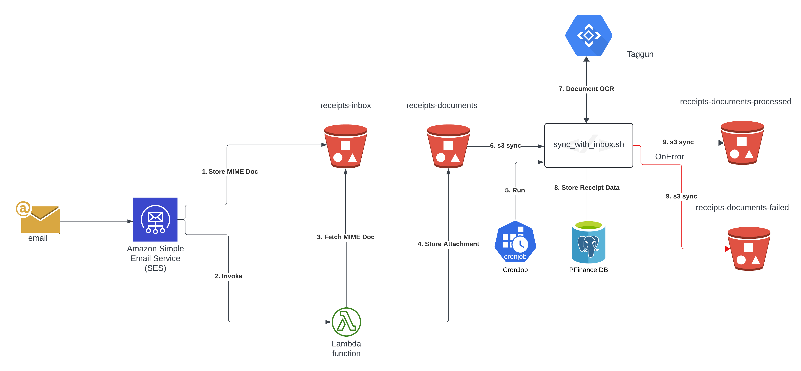

### Receipts Ingestion

I have been experimenting with [Taggun](https://www.taggun.io/) to store receipt line items in database. The intention is to be able
to match automatically receipts with transactions. At this stage I'm just collecting the data, the long term project is to be able to categorize
the line items (semi-automatically) to provide richer expenditure reports.

The diagram below shows a high level overview of the solution.

I've setup AWS SES to receive emails for a domain I control and set a processing rule to store the raw MIME message in an S3 bucket folder and to invoke
a lamba function. The lambda will extract the attachment and store it in a different folder on the same bucket. Meanwhile a cron job running on the 
PFinance EC2 instance will run a script that will pull down all the attachments found on the S3 bucket folder. For each file it will invoke the Taggun API and
process the JSON response into a DB receipt (receipt data and line items). If all succeeds it will move the attachment to another S3 bucket folder, this is the long 
term storage of the receipts scan and, at a later time, will be accessible through the API. If something fails the file is moved to a different folder for 
later investigation.
